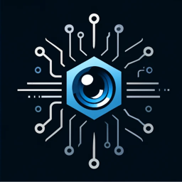
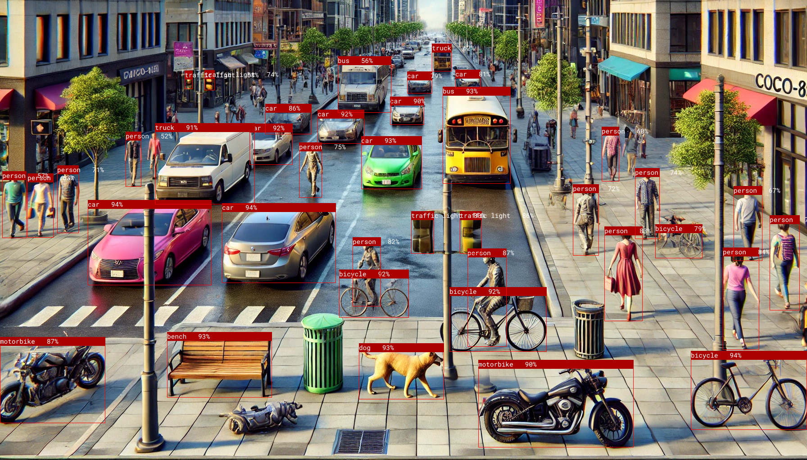
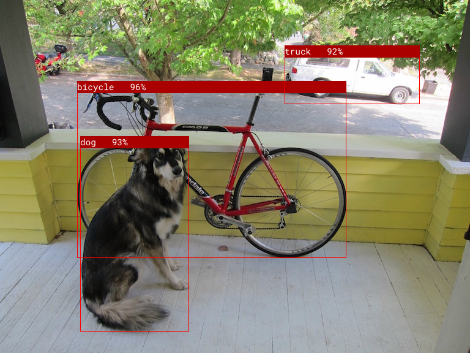

<div style="display: flex; justify-content: space-between; align-items: flex-start; width: 100%;">
    
    
</div>


# Object Detection Service

Object detection service written in Rust with Onnx inference engine.
Supports Blue Iris and Agent DVR.

## TL;DR

Current features:

| Feature                                     | Windows x86_64 | Linux x86_64 |
|---------------------------------------------|:--------------:|:------------:|
| RT-DETR-V2 ONNX Models                      | 🟢             | 🟢          |
| Yolo 5 ONNX Models (including custom)       | 🟢             | 🟢          |
| Run as a service                            | 🟢             | ❌          |
| Docker image                                | ❌             | 🟢          |
| CPU Inference                               | 🟢             | 🟢          |
| AMD GPU Inference                           | 🟢             | ❌          |
| Intel GPU Inference                         | 🟢             | ❌          |
| Nvidia GPU Inference                        | 🟢             | ❌          |
| Coral TPU Inference                         | ❌             | ❌          |


## Install on Windows (Recommended)

**Download the Windows installer from [Releases](https://github.com/xnorpx/blue-onyx/releases) for the best installation experience.**

The Windows installer provides:
- Complete installation of all executables and dependencies
- Automatic Windows service installation and startup
- AI model download during installation
- Desktop and start menu shortcuts
- System PATH integration
- Professional uninstall support

### Installation Steps:
1. Download the latest `blue-onyx-installer.exe` from [Releases](https://github.com/xnorpx/blue-onyx/releases)
2. Run the installer as Administrator
3. Select installation components:
   - **Blue Onyx Core** (required) - Main executables and dependencies
   - **Blue Onyx Service** (recommended) - Windows service for automatic startup
   - **Desktop Shortcuts** - Quick access shortcuts on desktop
   - **Start Menu Shortcuts** - Program group in start menu
4. Follow the installation wizard
5. Access the web interface at http://127.0.0.1:32168

The service will start automatically and run in the background. You can manage it through Windows Services or the provided shortcuts.

See the [Windows Installation](https://xnorpx.github.io/blue-onyx/windows_install.html) chapter in the documentation for detailed installation instructions and troubleshooting.

## Manual Installation on Windows

For advanced users who prefer manual installation:

### Install as service on Windows (Manual)

**Note: You need to run as administrator to register the service and change the install path and command line arguments for your setup.**
```powershell
sc.exe create blue_onyx_service binPath= "$env:USERPROFILE\.blue-onyx\blue_onyx_service.exe --port 32168" start= auto displayname= "Blue Onyx Service"
net start blue_onyx_service
```

Verify it is working by going to http://127.0.0.1:32168/

(If you don't want to run blue_onyx as a service you can just run blue_onyx.exe)

## Docker container on Linux

```bash
docker pull ghcr.io/xnorpx/blue_onyx:latest
docker run -d -p 32168:32168 ghcr.io/xnorpx/blue_onyx:latest --log-level debug --port 32168
```

## I don't trust scripts I want to install myself

- [Download latest release](https://github.com/xnorpx/blue-onyx/releases)
- Unzip
- Run blue_onyx

## Notes on Linux

If you run outside of docker you need to install OpenSSL 3

## Tips

Help:
```bash
blue_onyx.exe --help
```

Download models:
```bash
blue_onyx.exe --download-model-path .
```

Run service with larger model:
```bash
blue_onyx.exe --model rt-detrv2-x.onnx
Initializing detector with model: "rt-detrv2-x.onnx"
```

Benchmark GPU
```bash
blue_onyx_benchmark.exe --repeat 100 --save-stats-path .
Device Name,Version,Type,Platform,EndpointProvider,Images,Total [s],Min [ms],Max [ms],Average [ms],FPS
Intel(R) Iris(R) Xe Graphics,0.1.0,GPU,Windows,DML,100,14.3,116.8,168.3,143.2,7.0
```

Benchmark CPU
```bash
blue_onyx_benchmark.exe --repeat 100 --save-stats-path . --force-cpu
Device Name,Version,Type,Platform,EndpointProvider,Images,Total [s],Min [ms],Max [ms],Average [ms],FPS
12th Gen Intel(R) Core(TM) i7-1265U,0.1.0,CPU,Windows,CPU,100,28.2,239.6,398.2,281.5,3.6
```

Test Service
```bash
blue_onyx.exe
```

Then run in another terminal do 100 requests with 100 ms interval
```bash
test_blue_onyx.exe --number-of-requests 100 --interval 100
```

Test image and save image with boundary box use --image to specify your own image.
```bash
blue_onyx_benchmark.exe --save-image-path .
```

<div align="center">
    
</div>
