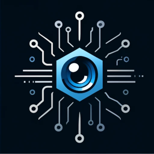
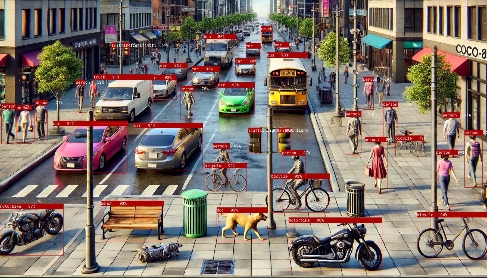
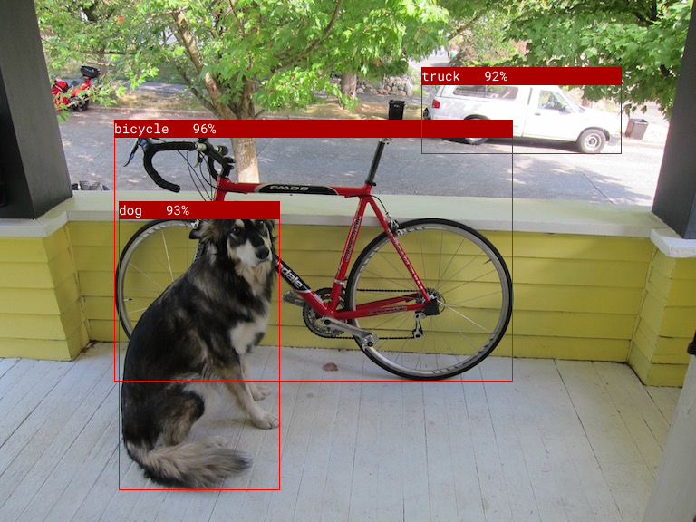

<div style="display: flex; justify-content: space-between; align-items: flex-start; width: 100%;">
    
    
</div>


# Object Detection Service

Object detection service written in Rust with Onnx inference engine.
Supports Blue Iris and Agent DVR.

## TL;DR

Current features:

| Feature                                     | Windows x86_64 | Linux x86_64 | macOS arm64 |
|---------------------------------------------|:--------------:|:------------:|:-----------:|
| RT-DETR-V2 ONNX Models                      | 🟢             | 🟢           | 🟢          |
| Yolo 5 ONNX Models (including custom)       | 🟢             | 🟢           | 🟢          |
| Run as a service                            | 🟢             | ❌           | ❌          |
| Docker image                                | ❌             | 🟢           | ❌          |
| CPU Inference                               | 🟢             | 🟢           | 🟢          |
| Apple GPU / Neural Engine Inference         | ❌             | ❌           | 🟢          |
| AMD GPU Inference                           | 🟢             | ❌           | ❌          |
| Intel GPU Inference                         | 🟢             | 🟢 OpenVINO  | ❌          |
| Nvidia GPU Inference                        | 🟢             | ❌           | ❌          |
| Coral TPU Inference                         | ❌             | ❌           | ❌          |


## Install on Windows with THE one mighty oneliner

```powershell
 powershell -NoProfile -Command "curl 'https://github.com/xnorpx/blue-onyx/releases/latest/download/install_latest_blue_onyx.ps1' -o 'install_latest_blue_onyx.ps1'; Unblock-File '.\install_latest_blue_onyx.ps1'; powershell.exe -ExecutionPolicy Bypass -File '.\install_latest_blue_onyx.ps1'"
```

## Install as service on Windows

**Note: You need to run as administrator to register the service and change the install path and command line arguments for your setup.**
```powershell
sc.exe create blue_onyx_service binPath= "$env:USERPROFILE\.blue-onyx\blue_onyx_service.exe --port 32168" start= auto displayname= "Blue Onyx Service"
net start blue_onyx_service
```

Verify it is working by going to http://127.0.0.1:32168/

(If you don't want to run blue_onyx as a service you can just run blue_onyx.exe)

## Docker container on Linux

### CPU

```bash
docker pull ghcr.io/xnorpx/blue_onyx:latest
docker run -d -p 32168:32168 ghcr.io/xnorpx/blue_onyx:latest
```

### Intel GPU with OpenVINO

The OpenVINO build accelerates inference on Intel integrated and discrete GPUs.
It uses the ONNX Runtime OpenVINO execution provider with FP16 precision and a
compiled-model cache. AMD and Nvidia GPU inference are not provided by this
build.

Requirements:

- Linux x86_64 with a supported Intel GPU and working Intel graphics driver
- The GPU render device available as `/dev/dri/renderD128`
- Docker access to the render device

Confirm that the render device exists:

```bash
ls -l /dev/dri/renderD128
```

Build the OpenVINO image from the `openvino-linux` branch:

```bash
git clone --branch openvino-linux https://github.com/slflowfoon/blue-onyx.git
cd blue-onyx
docker build -f Dockerfile.openvino -t blue-onyx-openvino:0.8.0-openvino2 .
mkdir -p config logs
sudo chown -R 1000:1000 config logs
```

Run it with the Intel render device passed through:

```bash
docker run -d \
  --name blue-onyx \
  --device /dev/dri/renderD128:/dev/dri/renderD128 \
  -p 32168:32168 \
  -v "$(pwd)/config:/app/config" \
  -v "$(pwd)/logs:/app/logs" \
  blue-onyx-openvino:0.8.0-openvino2
```

Alternatively, use the included Compose deployment:

```bash
docker compose -f deployment/docker-compose.yml up -d
```

Open `http://localhost:32168/stats` and confirm that **Execution Provider** is
`OpenVINO(GPU 0)`. Use `--gpu-index N` to select another Intel GPU. Pass
`--force-cpu` to use CPU inference instead.

If the container cannot open the render device, grant the container user access
through the host's `render` group or adjust the device permissions. See
[OPENVINO.md](OPENVINO.md) for implementation and deployment details.

## macOS on Apple Silicon

Download the `macos-aarch64` archive from the [latest release](https://github.com/xnorpx/blue-onyx/releases/latest), extract it, and run `blue_onyx`. CoreML hardware acceleration is enabled by default; pass `--force-cpu` to use only the CPU.

## I don't trust scripts I want to install myself

- [Download latest release](https://github.com/xnorpx/blue-onyx/releases)
- Unzip
- Run blue_onyx

## Automatic Model Management

Blue Onyx automatically downloads and manages models for you:

- **Default Model**: `rt-detrv2-s.onnx` is used by default
- **Auto-Download**: Models are downloaded automatically on first use
- **Multiple Model Types**: RT-DETR v2 (general purpose) and YOLO5 (specialized)

### Manual Model Download

```bash
# List all available models
blue_onyx --list-models

# Download all models
blue_onyx --download-model-path ./models --download-all-models

# Download only RT-DETR v2 models (recommended for general use)
blue_onyx --download-model-path ./models --download-rt-detr2

# Download only YOLO5 specialized models (IP cameras, delivery detection)
blue_onyx --download-model-path ./models --download-yolo5
```

### Available Models

| Model Type | Models | Use Case | Size |
|------------|--------|----------|------|
| **RT-DETR v2** | rt-detrv2-s/ms/m/l/x | General object detection (80 COCO classes) | 80MB - 400MB |
| **YOLO5 Specialized** | delivery, IPcam-animal, ipcam-bird, etc. | IP cameras, delivery detection | ~25MB each |

## Quick Usage Examples

### Basic Usage

```bash
# Start with default settings (auto-downloads rt-detrv2-s.onnx)
blue_onyx

# Start with specific model
blue_onyx --model ./models/rt-detrv2-l.onnx

# Start with specialized model for delivery detection
blue_onyx --model ./models/delivery.onnx --object-detection-model-type yolo5
```

### Configuration

```bash
# Custom port and confidence threshold
blue_onyx --port 8080 --confidence_threshold 0.7

# Filter for specific objects only
blue_onyx --object_filter person,car,bicycle

# Force CPU usage (disable GPU)
blue_onyx --force_cpu

# Enable debug logging
blue_onyx --log_level Debug
```

## Notes on Linux

If you run outside of docker you need to install OpenSSL 3

## Performance Testing

### Benchmark GPU
```bash
blue_onyx_benchmark --repeat 100 --save-stats-path .
Device Name,Version,Type,Platform,EndpointProvider,Images,Total [s],Min [ms],Max [ms],Average [ms],FPS
Intel(R) Iris(R) Xe Graphics,0.1.0,GPU,Windows,DML,100,14.3,116.8,168.3,143.2,7.0
```

### Benchmark CPU
```bash
blue_onyx_benchmark --repeat 100 --save-stats-path . --force-cpu
Device Name,Version,Type,Platform,EndpointProvider,Images,Total [s],Min [ms],Max [ms],Average [ms],FPS
12th Gen Intel(R) Core(TM) i7-1265U,0.1.0,CPU,Windows,CPU,100,28.2,239.6,398.2,281.5,3.6
```

## Testing

### Test Service
```bash
blue_onyx
```

Then run in another terminal to do 100 requests with 100 ms interval:
```bash
test_blue_onyx --number-of-requests 100 --interval 100
```

### Test Detection and Save Results
```bash
blue_onyx_benchmark --save-image-path .
```

<div align="center">
    
</div>

## API Usage

### Detect Objects in Images

```bash
# Upload image file
curl -X POST -F "image=@test.jpg" http://localhost:32168/detect

# Detect from URL
curl -X POST -H "Content-Type: application/json" \
  -d '{"url": "https://example.com/image.jpg"}' \
  http://localhost:32168/detect
```

### Web Interface

Open your browser and go to: `http://localhost:32168/`

## Documentation

For detailed documentation, visit: [Blue Onyx Documentation](https://xnorpx.github.io/blue-onyx/)

- **[Getting Started](https://xnorpx.github.io/blue-onyx/get_started.html)** - Quick start guide
- **[Models](https://xnorpx.github.io/blue-onyx/models.html)** - Available models and usage
- **[Configuration](https://xnorpx.github.io/blue-onyx/configuration.html)** - Detailed configuration options
- **[Windows Installation](https://xnorpx.github.io/blue-onyx/windows_install.html)** - Windows setup guide
- **[Linux Installation](https://xnorpx.github.io/blue-onyx/linux_install.html)** - Linux/Docker setup
- **[FAQ](https://xnorpx.github.io/blue-onyx/faq.html)** - Common questions and troubleshooting
