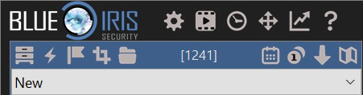
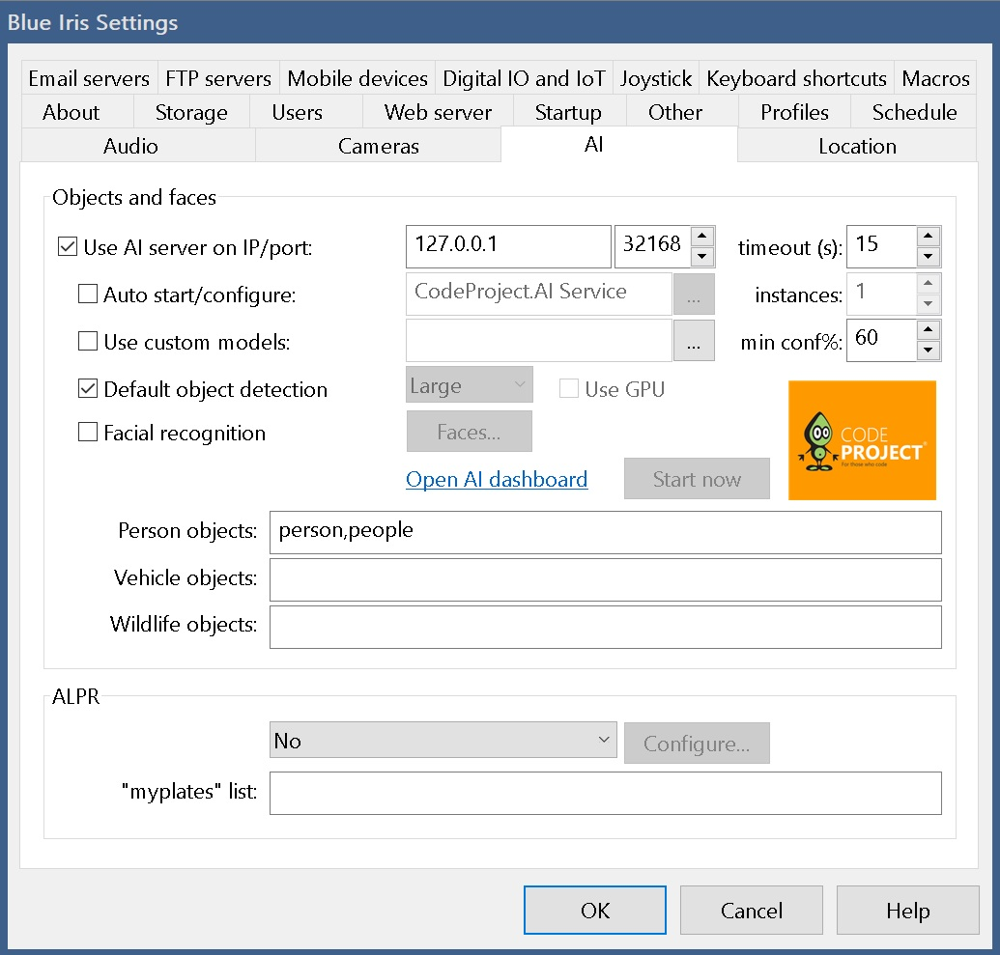
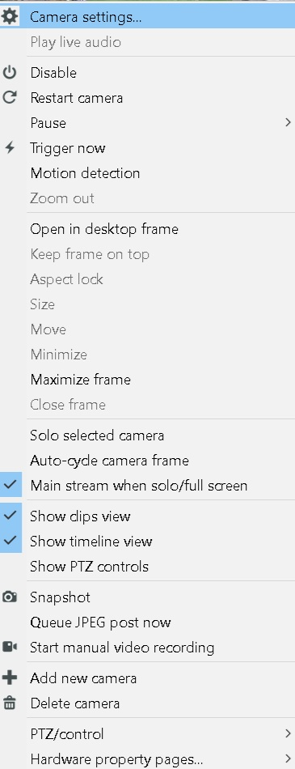
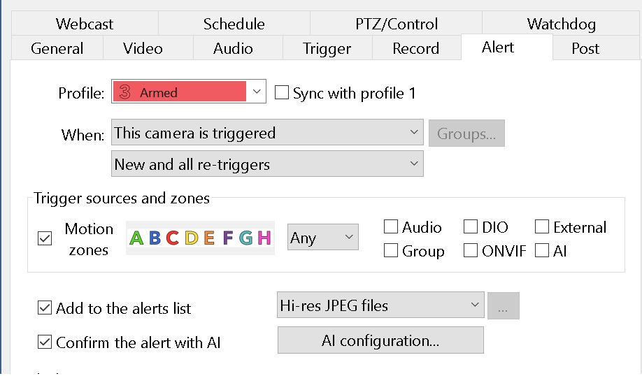
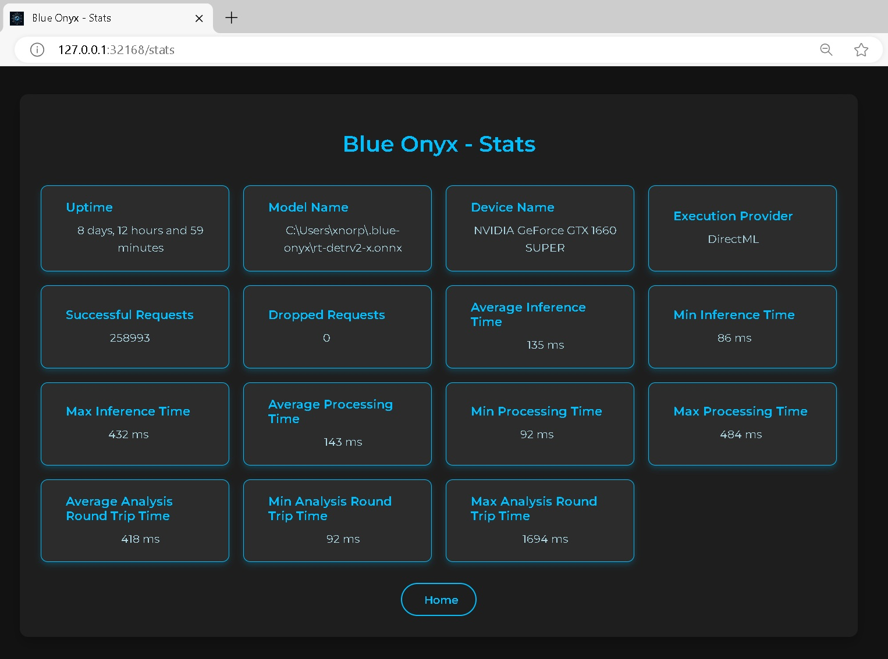

# Configure Blue Iris

Blue Onyx runs as a service, it has a simple job. It receives a image in jpg format from Blue Iris. It will run it through detection pipeline and it will report if it found any of the objects that the currently used model have if any in the picture. Once Blue Iris get's the response it will act based on this information.

**NOTE: BLUE ONYX DOES NOT SUPPORT RUNNING MULTIPLE MODELS IN ONE SERVER, IT'S ONE SERVER ONE MODEL. SETUP MULTIPLE SERVERS AND DUPLICATE STREAMS IF YOU WANT TO RUN SEPARATE MODELS FOR 1 CAMERA.**

## Setup

See this for general Blue Iris setup: https://youtu.be/jqc1ukrkMmI?si=9cDS3uYp2tQUGbIt&t=1

## AI Setup

Please refer to the [documentation](https://blueirissoftware.com/blueiris.pdf) for more details. For specific Blue Iris questions please reach out to Blue Iris support.

Press the cogwheel in Blue Iris for settings.

Press the AI tab. Replace ip and port as needed.

Then go in to each individual camera setting by right click on the camera and then click Camera Settings.

Then press alert tab and then AI configuration

Here you can override the AI server if you are running multiple instances of Blue Onyx.
Avoid using main stream as the service will anyway resize the pictures to smaller resolution and it only cost cpu time to decode large jpg images.

Then go back, right click on the camera again and then press trigger now.

If everything is configured correctly you should see succesful request count increase in the stats page.

