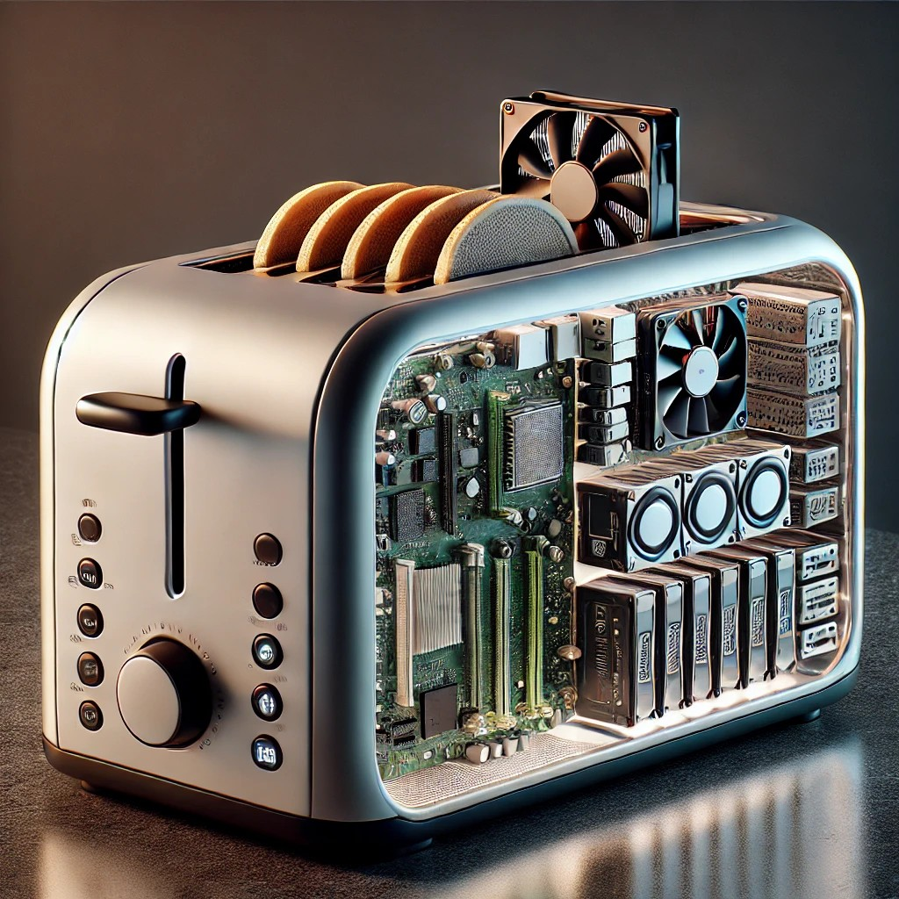

# Blue Onyx Object Detection Service

Blue Onyx is a simple and reliable object detection server designed for local use. Built in Rust on top of the [ONNX runtime](https://github.com/microsoft/onnxruntime), it offers a dependable inference engine.

    

        Blue Onyx was created out of frustration with other open-source object detection services, which often consisted of hastily assembled Python code under HTTPS endpoints.
    

    

        
    

This led to the question: can this be done in a simpler, more robust way than other solutions?

To avoid the feature creep that plagues other solutions, Blue Onyx is designed to address specific problems (object detection). Its main goals are stability, ease of upgrade, and decent performance across a wide range of consumer hardware.

With this philosophy, Blue Onyx is designed with certain limitations. It is unlikely to support:

- Specialized NPU/TPU hardware
- Dynamic switching of multiple models at runtime (instead, run multiple Blue Onyx instances)

These constraints help maintain the service's simplicity and robustness.

For example, if you are using an x86 Windows or standard Linux distribution with a consumer CPU/GPU combo and need a stable object detection service that works with new state-of-the-art models, Blue Onyx might be right for you.

Once, during an all-hands meeting at a company I worked for that had just been acquired by a big tech firm, a Linux engineer asked the CEO of the big tech firm if we would continue to support all the various hardware we currently supported. The CEO responded, "we cannot support all different toasters out there."

    

        If you are using an unRAID toaster with Coral TPUs and running Docker inside Proxmox and an NVIDIA datacenter Tesla GPU, Blue Onyx might not meet all your requirements.
    

    

        
    

