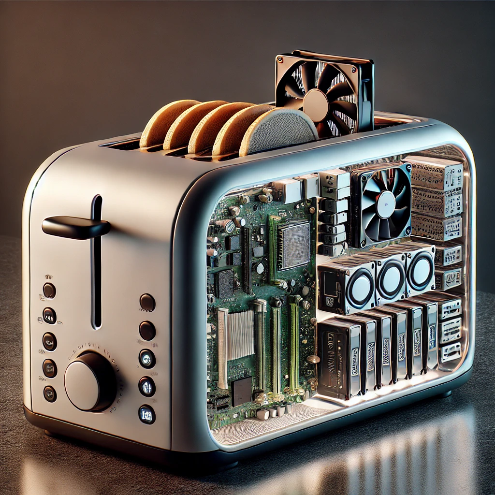

# Blue Onyx Object Detection Service

Blue Onyx is a simple object detection server for runnin local object detection service. Built in Rust on top of the [ONNX runtime](https://github.com/microsoft/onnxruntime), which provides the inference engine.

    

        Blue Onyx was created out of frustration with other open-source object detection services, which were often a mix of hastily assembled Python code under HTTPS endpoints.
    

    

        
    

Hence, the idea arose: can this be done in a simpler, more robust way than other solutions?

To avoid falling into the same feature creep traps as other solutions, Blue Onyx is designed to solve limited problems (detect objects). Its main goals are to be stable, easy to upgrade, and to have decent performance over a wide range of normal consumer hardware.

With this philosophy in mind, Blue Onyx is designed with certain limitations. It is unlikely to support:

- Specialized NPU/TPU hardware
- Dynamic switching of multiple models at runtime (instead run multiple Blue Onyx instances)

These constraints help maintain the simplicity and robustness of the service.

For example, if you are running an x86 Windows or standard Linux distribution with a consumer CPU/GPU combo and want a stable object detection service that just works with new state-of-the-art object detection models, then Blue Onyx might be right for you.

    

        However, if you are running an ARM-based unRAID toaster with Hailo or Coral TPUs, with docker inside proxmox and NVIDIA datacenter Tesla GPU, Blue Onyx might not fulfill all your requirements.
    

    

        
    

